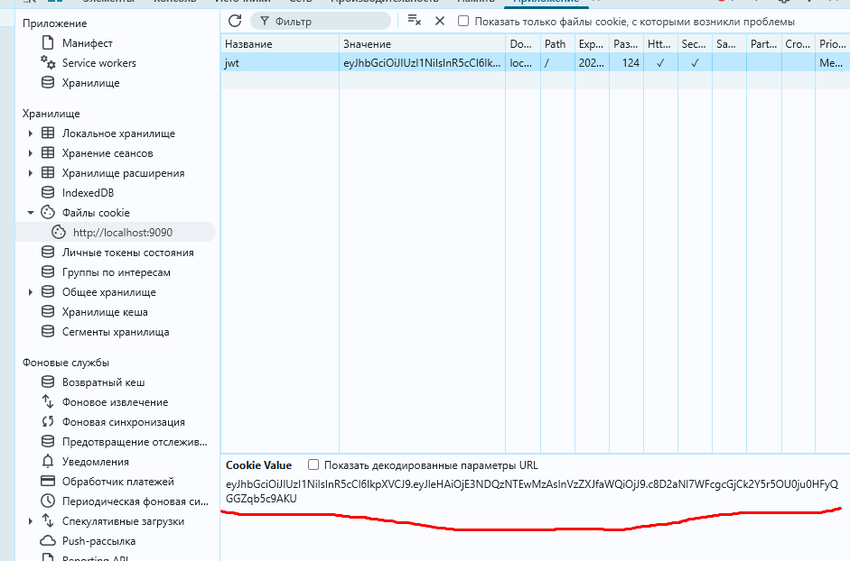

# Race Condition CTF Challenge

## Описание уязвимости
**Race Condition** – это уязвимость, возникающая из-за отсутствия атомарных операций или транзакций при выполнении операций на сервере. 
Так, например, классическим примером является перевод денег с банковского счета клиента A на счет клиента B.
Изменения, связанные с обновлением счета клиента A и клиента B должны бытьобернуты в транзакцию, чтобы они выполнились оба
или не выполнились вовсе.

## Почему возникает уязвимость?
1. **Отсутствие атомарности операций**: При выполнении последовательных действий, как правило, происходит сначала проверка состояния, а потом его изменение. Если между этими операциями нет блокировок или транзакций, возможна ситуация, когда несколько запросов одновременно видят одинаковое исходное состояние и изменяют его независимо друг от друга.
2. **Недостаточная синхронизация доступа**: Когда несколько процессов или потоков получают доступ к одним и тем же данным без должного контроля, это может привести к тому, что итоговое состояние будет некорректным. Такие ситуации часто возникают при распределённых вычислениях, параллельной обработке запросов, а также в сценариях, когда используются внешние сервисы без гарантии последовательной обработки.

## Способы защиты
1. **Использование транзакций**: Объединение нескольких операций проверки и изменения состояния в единую атомарную транзакцию обеспечивает их выполнение как единого целого. В случае возникновения ошибки вся транзакция откатывается, что предотвращает возникновение неконсистентного состояния.
2. **Блокировки и мьютексы**: Реализация механизмов синхронизации доступа к разделяемым ресурсам (например, использование блокировок, мьютексов или семафоров) позволяет гарантировать, что только один процесс изменяет данные в конкретный момент времени.
3. **Ограничение частоты операций и rate limiting**: Введение ограничений на число запросов, которые могут быть выполнены за определённое время, помогает снизить вероятность возникновения гонок и атак, эксплуатирующих данную уязвимость.

## Запуск приложения

Для запуска приложения выполните следующие шаги:

1. **Клонирование репозитория**:
   ```bash
   git clone https://github.com/yourusername/ctf_tasks.git
   cd ctf_tasks/race_condition

2. Запустите приложение через Docker Compose:
   ```bash
   docker-compose up --build
   ```

3. Приложение будет доступно по адресу: [http://localhost:9090](http://localhost:9090)


4. Для остановки приложения выполните:
   ```bash
   docker-compose down -v
   ```
## Конфигурация приложения
Для настройки данного приложения используются переменные окружения, прописываемые в docker-compose файле.
- `CTF_FLAG` - флаг задания.

## Описание уязвимости в данном приложении
В данном приложении уязвимость связана с тем, что операция проверки "был ли уже выдан бонус", операция выдачи бонуса
 и операция проставления флага "бонус был выдан" происходят не в рамках 1 транзакции. Таким образом, злоумешленник может послать несколько запросов одновременно.
В таком случае может произойти ситуация, при которой несколько запросов прохоят проверку и вместе обновляют счет.

## Шаги для получения флага
Для использования уязвимости выполните следующие шаги:

1. Создаем новый аккаунт и входим в него. Идем на адрес http://localhost:9090/users/signup, затем http://localhost:9090/users/login
2. Видим, что есть страница получения бонуса http://localhost:9090/bonus. Выясняем, что при отправке POST-запроса на данный endpoint 
нам зачисляются бонусы. Также видим, что бонус может быть зачислен на аккаунт только 1 раз.
3. Отсылаем несколько одновременных запросов. Получаем >= 200 бонусов.

Для более удобной атаки, был подготовлен скрипт attack/main.py. Для его использования надо Получить свой jwt-токен

Далее нужно в самом скрипте прописать атакуемый эндпоинт и значение jwt-токена. Скрипт будет отсылать много асинхронных 
POST-запросов на данный эндпоинт.
   ```bash
   python -m venv venv
   source venv/bin/activate
   pip install -r requirements.txt
   python main.py
   ```
После выполнения скрипта на аккаунте будет необходимое кол-во баллов.


4. Делаем GET-запрос на endpoint http://localhost:9090/flag и получаем флаг.
